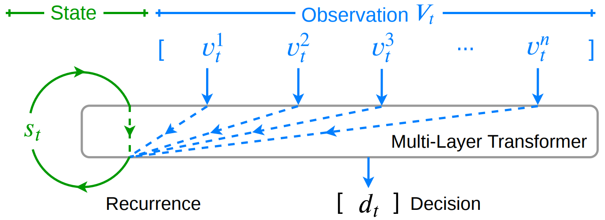
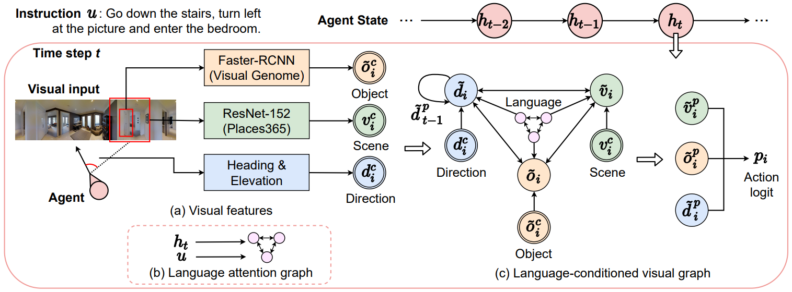
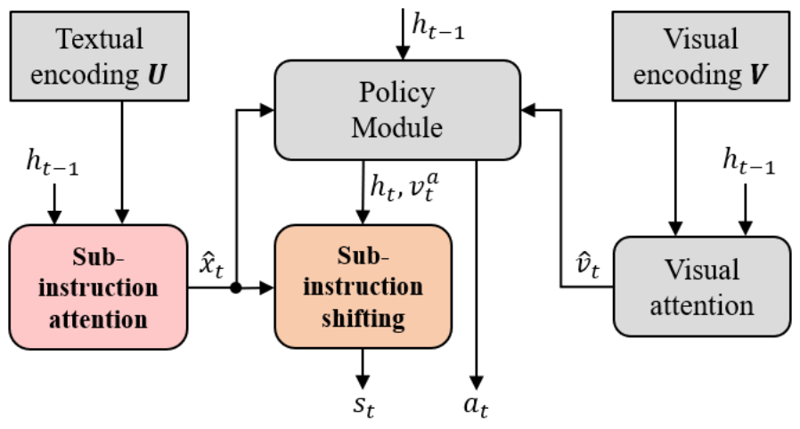

**A Recurrent Vision-and-Language BERT for Navigation** 
[**Yicong Hong**](http://www.yiconghong.me/), [Qi Wu](http://www.qi-wu.me/), [Yuankai Qi](https://sites.google.com/site/yuankiqi/home), [Cristian Rodriguez-Opazo](https://crodriguezo.github.io/), [Stephen Gould](http://users.cecs.anu.edu.au/~sgould/) 

In the <em>Conference on Computer Vision and Pattern Recognition (CVPR)<em>, 2021. 
[[Paper & Supplemental](https://arxiv.org/abs/2011.13922)] [[GitHub](https://github.com/YicongHong/Recurrent-VLN-BERT)] 

---

**Language and Visual Entity Relationship Graph for Agent Navigation** 
[**Yicong Hong**](http://www.yiconghong.me/), [Cristian Rodriguez-Opazo](https://crodriguezo.github.io/), [Yuankai Qi](https://sites.google.com/site/yuankiqi/home), [Qi Wu](http://www.qi-wu.me/), [Stephen Gould](http://users.cecs.anu.edu.au/~sgould/) 

In the <em>Conference on Neural Information Processing Systems (NeurIPS)</em>, 2020. 
[[Paper](https://papers.nips.cc/paper/2020/hash/56dc0997d871e9177069bb472574eb29-Abstract.html)] [[Supplemental](https://papers.nips.cc/paper/2020/file/56dc0997d871e9177069bb472574eb29-Supplemental.pdf)] [[GitHub](https://github.com/YicongHong/Entity-Graph-VLN)] 

---

**Sub-Instruction Aware Vision-and-Language Navigation** 
[**Yicong Hong**](http://www.yiconghong.me/), [Cristian Rodriguez-Opazo](https://crodriguezo.github.io/), [Qi Wu](http://www.qi-wu.me/), [Stephen Gould](http://users.cecs.anu.edu.au/~sgould/) 

In the <em>Conference on Empirical Methods in Natural Language Processing (EMNLP)</em>, 2020. 
[[Paper & Supplemental](https://www.aclweb.org/anthology/2020.emnlp-main.271/)] [[GitHub](https://github.com/YicongHong/Fine-Grained-R2R)] 
